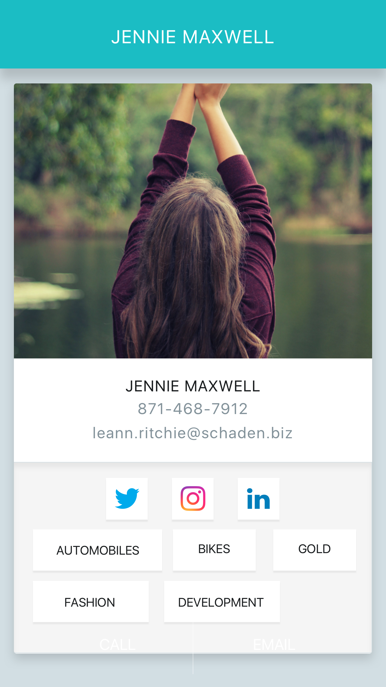
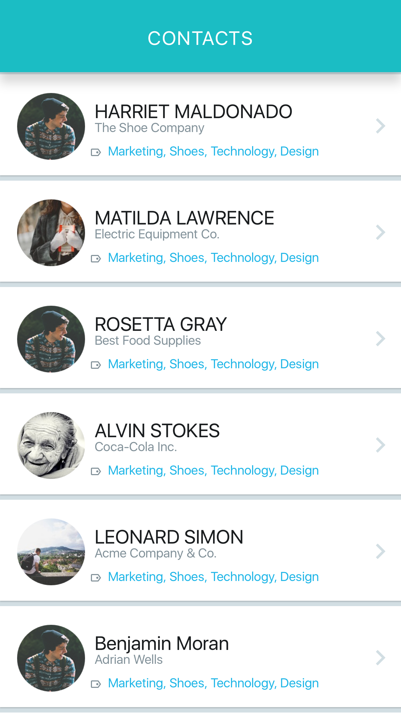
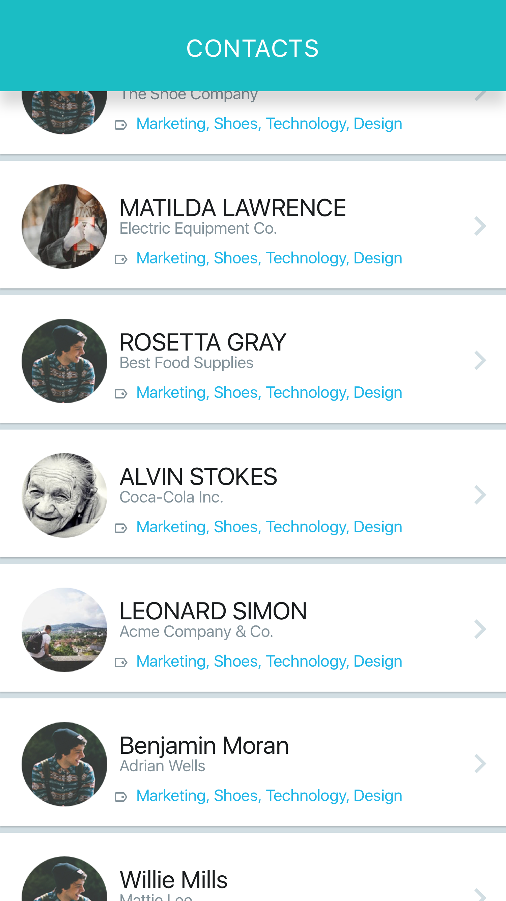

# Contacts

Create a contacts application using HTML, CSS and Javascript.

## Requirements
- The app should only work on cellphones and tables. Desktop is not required.
- The app should match the mocks as much as possible

## User Stories
- As a user I should be able to see all my contacts in a list
- As a user I should be able to scroll through all my contacts
- As a user I should be able to see details about a user in another screen

## Screens
#### Profile

#### Search

